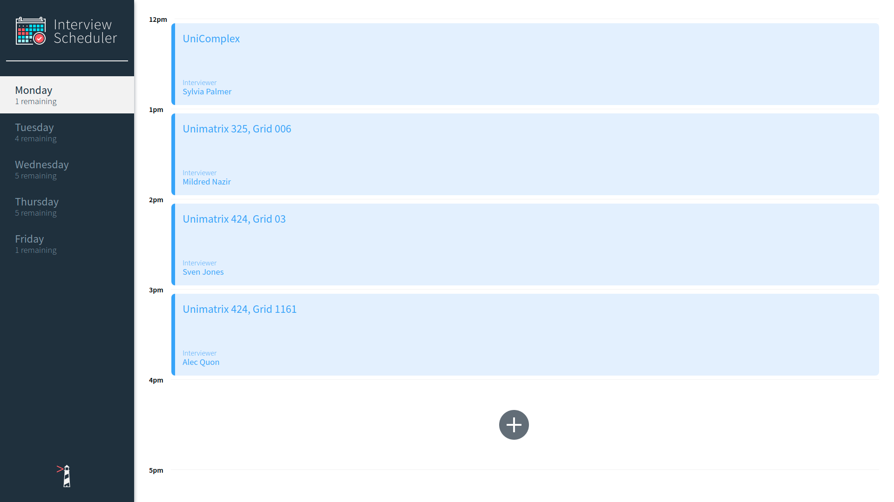
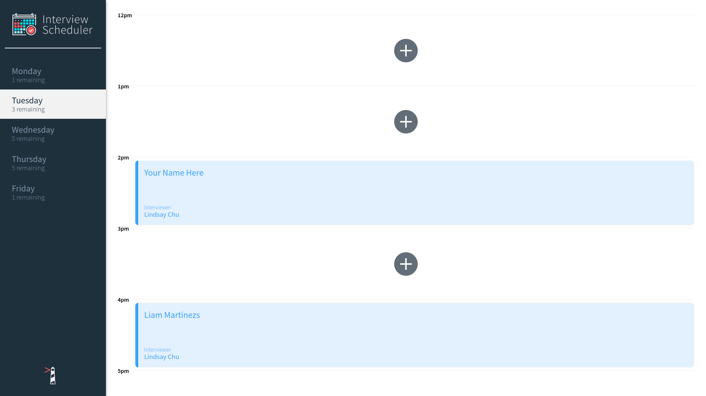
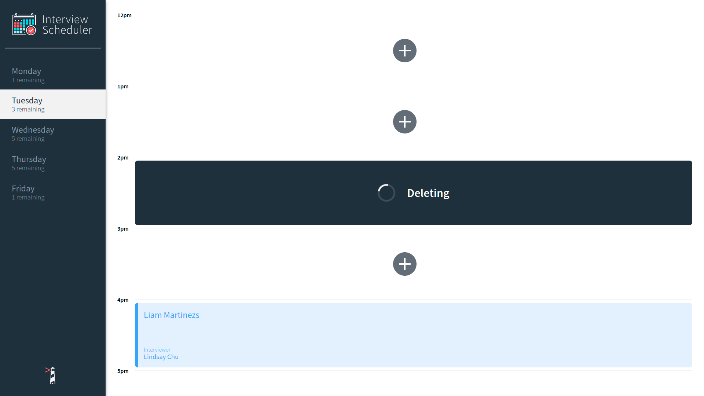
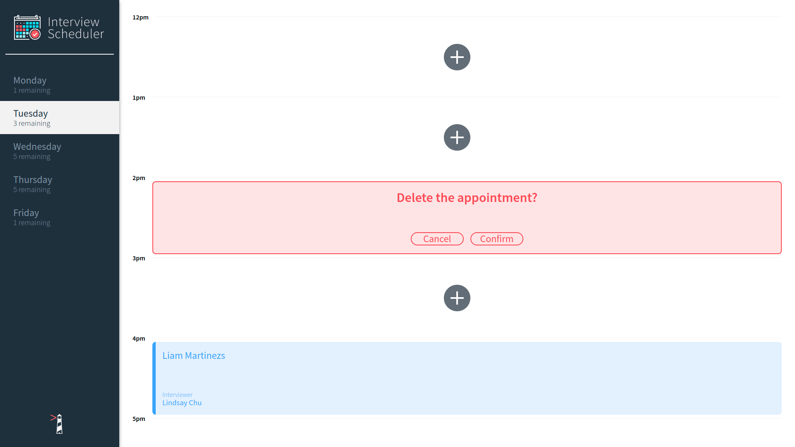

# Interview Scheduler

## Setup

Install dependencies with `npm install`.

## Running Webpack Development Server

```sh
npm start

In the .env.development file, it may be required to change the PORT to 8000.
Additionally, inside the package.json file, you may need to change "proxy": "http://localhost:8007" to "proxy": "http://localhost:8001".

You may also need to uncomment axios lines in the index.js file.
```

## Running Jest Test Framework

```sh
npm test
```

## Running Storybook Visual Testbed

```sh
npm run storybook
```

## devDependencies

- @babel/core: ^7.4.3,
- @storybook/addon-actions: ^5.0.10,
- @storybook/addon-backgrounds: ^5.0.10,
- @storybook/addon-links: ^5.0.10,
- @storybook/addons: ^5.0.10,
- @storybook/react: ^5.0.10,
- @testing-library/jest-dom: ^4.0.0,
- @testing-library/react": ^8.0.7",
- @testing-library/react-hooks: ^7.0.2,
- babel-loader: ^8.0.5,
- node-sass: ^4.14.0",
- react-test-renderer: ^16.9.0

## Screenshots

### Homepage



### Booking appointment


### Saving appointment


### After booking appointment



### Deleting appointment



### Deleting Confirmation


